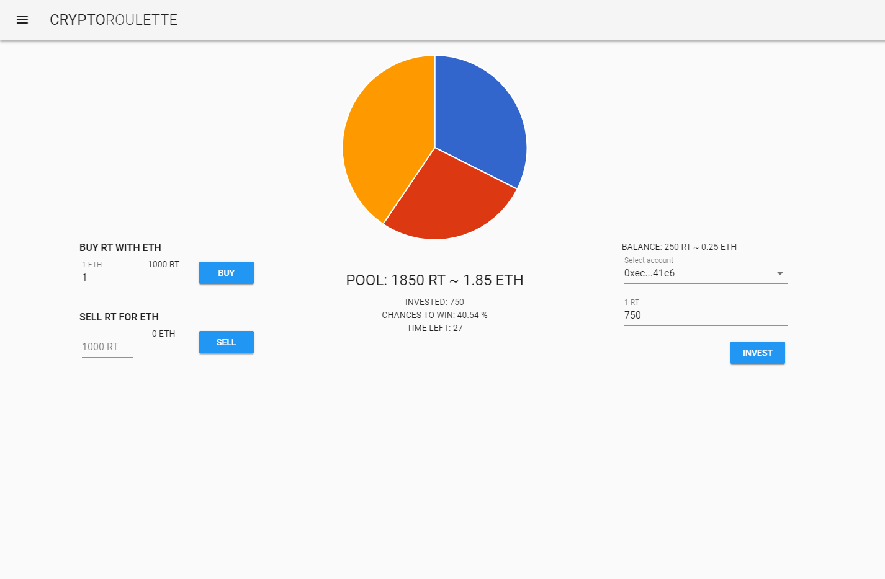

# Crypto-roulette

Crypto-roulette is an academic project, featuring ethereum blockchain.

## Description
Users can buy RT (roulette tokens) and use them to participate in a raffle. The more the user invests, the higher the chances are for them to win.

The app was made using Vue and Express. The contract is written in Solidity.

## Screenshot

## How to use
...